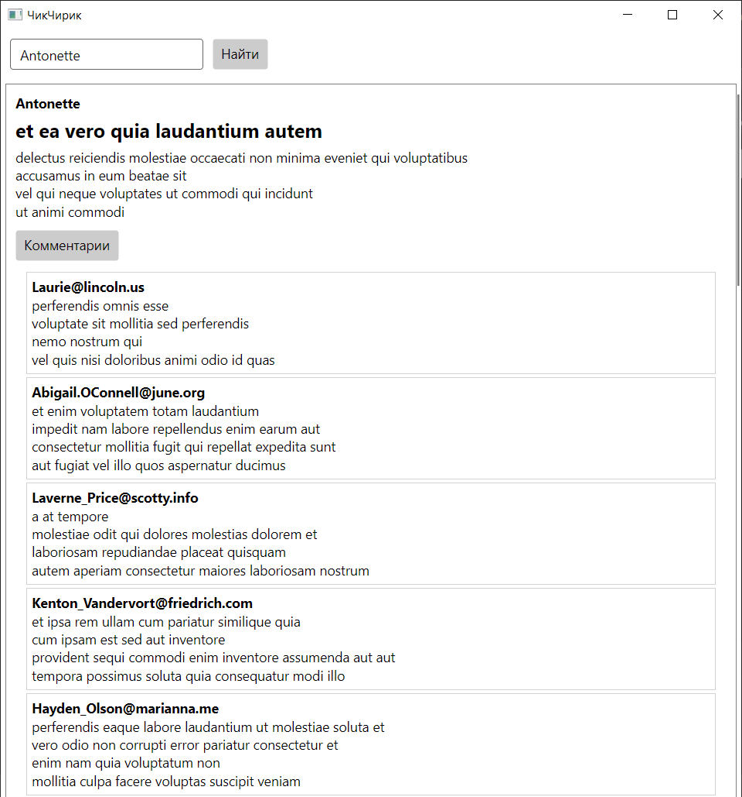

## 20 Баллов

Вы разрабатываете инновационную социальную сеть "ЧикЧирик". В её основе — лента постов, где каждый пост содержит никнейм автора, заголовок и текст. Пользователи могут искать посты конкретного автора по его имени через поиск. Кроме того, под каждым постом можно оставлять комментарии, содержащие email пользователя и текст самого комментария.

В рамках задания вам необходимо изучить API [JSONPlaceholder](https://jsonplaceholder.typicode.com/). Это бесплатный онлайн-REST API, предоставляющий фиктивные данные, идеально подходящие для тестирования и разработки.

Реализуйте методы `GetPostsAsync` и `GetCommentsAsync` в файле `ApiService.cs`, которые будут обращаться к этому API. Также допишите классы в папке `Models`. Убедитесь, что ваша реализация работает корректно, используя тесты, размещённые в `ApiServiceTests.cs`.

